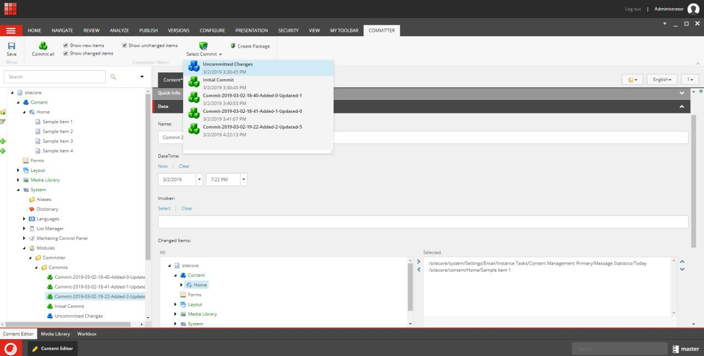

# Sitecore Committer Module

  

## Summary

  

**Category:** Best enhancement to the Sitecore Admin (XP) UI for Content Editors & Marketers

  

The main purposes of this module are the following:

1. Tracking what Sitecore content has been changed (for any database).

2. To see the list of items which have been added/deleted/changed.

3. To see the changes right in the content tree.

4. Keeping record of changes locally using commit (like Git).

5. Creating Sitecore package for each commit separately.

  
  

## Pre-requisites

  

Please ensure you have the following requirements installed:

- Sitecore Experience Platform 9.1 Initial Release

  

The module is based on Sitecore default functionality and doesn't require other Sitecore modules or frameworks.

  

## Installation

  

1. Use the Sitecore Update Installation Wizard to install the packages:

-  [Sitecore.Feature.Committer.Core.update](https://github.com/Sitecore-Hackathon/2019-Brave-Sitecorians/blob/master/sc.package/Sitecore.Feature.Committer.Core.update)

-  [Sitecore.Feature.Committer.Master.update](https://github.com/Sitecore-Hackathon/2019-Brave-Sitecorians/blob/master/sc.package/Sitecore.Feature.Committer.Master.update)

  

## Configuration

  

You don't need to configure anything else, the module is ready to be used once it's correctly installed. No file configurations are needed. 

## Usage 

The module helps Content Editors to track the content changes providing the visual interface right in the content tree
and allows to keep record of changes like git commit and export them as Sitecore package. This module also is suitable for developers, for instance, tracking item changes and adding those to commit withing a current task.

This module is suitable for both the content editors and developers. There is a new **Committer** Ribbon where all module actions are located. User can use the following Commiter actions:

- **Commit all**  - create new commit where all added/updated content items will be tracked.
- **Show new item** - show all created items with appropriate gutter icon in scope of either the selected commit or uncommitted changes.
- **Show changed items** - show all modified items with appropriate gutter icon in scope of either the selected commit or uncommitted - changes.
- **Show unchanged items** - show all unmodified items in scope of either the selected commit or uncommitted changes.
- **Select Commit** - allow user to observe the content changes in real time or select a commit for item reviewing in scope of the selected commit.
- **Create package** - allow user to create and generate a Sitecore package for selected commit.

 
To track content changes in real time user should select **Uncommitted Changes** like below: 

Using this module, content editor can generate a Sitecore package where all (in a scope of selected commit) tracked items will be included.

The Sitecore Committer Module supports database context switching.

## Video

